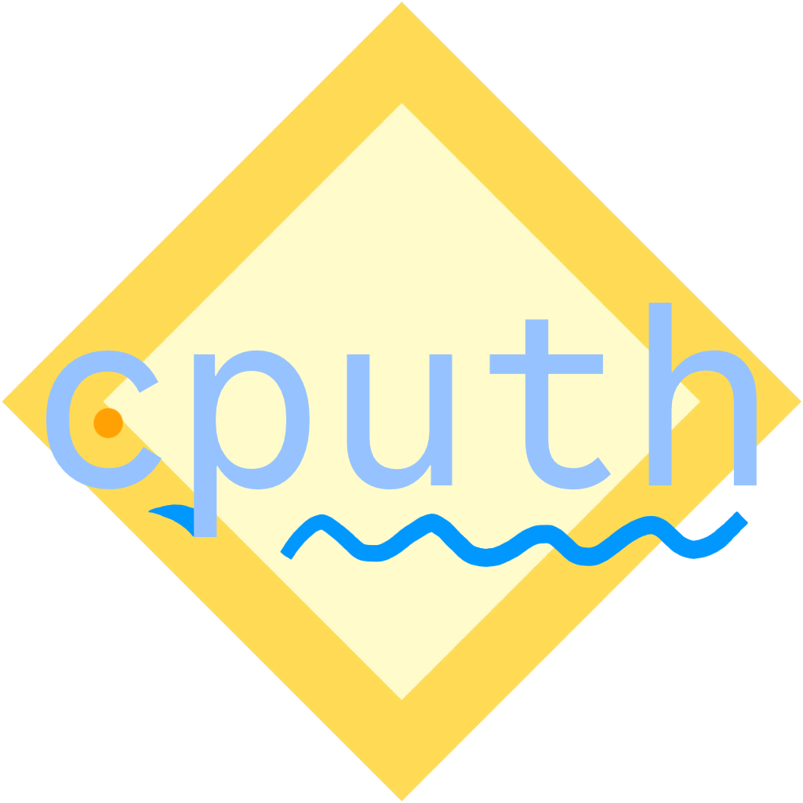

# cputh v0.5.0

<p align="center">
  
</p>

*You just want attention; your night has just begun. Maybe it's that unmatched paren on line 42*

Python but all the keywords are Charlie Puth lyrics. Inspired by the man the myth the legend's new album, *Whatever's Clever*, and the personality injection of ArnoldC, now the compiler has feelings about that extra space, and the REPL cries in falsetto. On top of that, the CPuth compiler is written in CPuth, because why not?

Free syntax highlighting extension for VS Code included! (see install details under Installation)

## Standard Library

CPuth also has a standard library. You can find ports of common Python standard library modules in [here](./stdlib/).

## Syntax

The following describes the syntax for CPuth. There are also some secrets...you'll just have to figure them out yourself!

### Imports
- `from_where_we_began` -> `from` (See You Again)
- `get_it_on` -> `import` (Marvin Gaye)

### Conditionals
- `attention` -> `if` (Attention)
- `left_right_left` -> `elif` (album: Nine Track Mind)
- `no_matter_where_you_go` -> `else` (One Call Away)
- `switch` -> `match` (Light Switch)
- `you_got_that` -> `case` (Light Switch)

### Membership, Logical Operators
- `i_still_look_at_you_the_same` -> `is` (Hey Brother)
- `all_up_on_ya` -> `in` (Attention)
- `nothing_left` -> `not` (Dangerously)
- `come_along_with_me` -> `and` (One Call Away)
- `share_our_fears` -> `or` (Changes)

### Loops
- `how_long` -> `while` (How Long)
- `runnin_round` -> `for` (Attention)
- `we_dont_talk_anymore` -> `break` (We Don't Talk Anymore)
- `move_on` -> `continue` (We Don’t Talk Anymore)
- `slow_it_down` -> `pass` (album: Voicenotes)

### Functions and Classes
- `then_theres_you` -> `class` (Then There’s You)
- `one_call_away` -> `def` (One Call Away)
- `smaller_talks` -> `lambda` (Changes)
- `done_for_me` -> `return` (Done for Me)
- `cheating_on_you` -> `yield` (Cheating on You)

### Scope Management
- `this_whole_world` -> `global` (My Gospel)
- `not_alone` -> `nonlocal` (One Call Away)
- `erase` -> `del` (Left and Right)

### Async Execution
- `i_still_can_hear_you` -> `async` (Changes)
- `it_wont_be_long` -> `await` (One Call Away)

### Exception Handling
- `promise_me` -> `assert` (I'll Be There For You)
- `dangerously` -> `try` (Dangerously)
- `please_forgive_me` -> `except` (I Used to Be Cringe)
- `see_you_again` -> `finally` (See You Again)
- `blame_myself` -> `raise`(Dangerously)

### Constants
- `TheWayIAm` -> `True` (album: Voicenotes)
- `ShouldveKnown` -> `False` (We Don't Talk Anymore)
- `EmptyCups` -> `None` (Empty Cups)

**Deprecated:** `Nothing` was used for `None` prior to v0.3.1 but is now removed as of v0.5.0. Use `EmptyCups` instead. Using `Nothing` will throw a `NameError` as it is not a recognised keyword.

### I/O
- `everyone_knows` -> `print` (My Gospel)
- `tell_me_honestly` -> `input` (How Long)

### Data Structures
- `lightswitch` -> `bool` (Light Switch)
- `memories` -> `list` (Left and Right)
- `mind` -> `dict` (Nine Track Mind)

### Context
- `stay_with_me` -> `with` (Stay)
- `call_me` -> `as` (One Call Away)

### Shorthand

Because CPuth keywords are quite long, we have shorthand for common combinations of keywords, as well as small conveniences like increment and decrement:

- `++` -> `+= 1`
- `--` -> `-= 1`
- `theres_been_some_changes` -> `is not` (Changes)
- `goin_round_in_circles` -> `while True` (Left and Right)
- `i_wouldnt_know_what_to_do` -> `raise NotImplementedError` (Until It Happens To You)
- `stay_here_for_a_while` -> `is not None` (One Call Away)
- `hear_me_out` -> `if __name__ == '__main__'` (Beat Yourself Up)

### Destructuring Statements

CPuth features some special idioms that use the destructuring operator: `-<`, such as:

- `sideways source -< k, v`
  - Dictionary iteration sugar. Shorter than using `running_round k, v all_up_on_ya source.items()`.
  - In a statement position, this becomes `for k, v in source.items():`
  - In an expression position, this becomes a comprehension-style `for ... in ...items()`
- `the_list_goes_on source -< i, item`
  - Enumeration sugar.
  - In a statement position, this becomes `for i, item in enumerate(source):`
  - In an expression position, this becomes a comprehension-style `for ... in enumerate(...)`
- `perfume_regret source, mode -< name` or `perfume_regret source -< name`
  - Context-manager sugar for files.
  - This is statement-only and becomes `with open(source, mode) as name:` or `with open(source) as name:`, depending on which form is used.
- `patient iterable, condition -< name`
  - Filtering sugar.
  - In a statement position, this becomes `for name in (name for name in iterable if condition):`
  - In an expression position, this becomes `name for name in iterable if condition`

Examples:

```py
sideways dct -< k, v:
    everyone_knows(f"{k}: {v}")

pairs = [(k, v) sideways dct -< k, v]

the_list_goes_on items -< i, item:
    everyone_knows(f"{i}. {item}")

patient nums, x > 0 -< x:
    everyone_knows(x)

positives = [patient nums, x > 0 -< x]

perfume_regret "./file.txt", "r" -< file:
    contents = file.read()
    everyone_knows(contents)
```

### Do-Until

A do-until loop in CPuth behaves like a do-while in C, but with the condition acting as a stopping condition rather than a continuity condition. This is useful for loops where you want to execute a block of code at least once, but continue until a certain condition is met.

Syntax:

- `thats_when_you_said:` starts the body
- `until_it_happens_to_you condition` ends the loop and provides the stopping condition

The body always runs at least once. After that, CPuth keeps looping until the `until_it_happens_to_you` condition becomes true.

Example:

```py
x = 0

thats_when_you_said:
    x++
    everyone_knows(f"right now, x is {x}")
until_it_happens_to_you x >= 10

everyone_knows("x is now greater than or equal to 10")
```

Multiline conditions are also allowed:

```py
thats_when_you_said:
    x++
    y++; y++; y++
until_it_happens_to_you (
    x >= 10 share_our_fears y >= 6
)
```

## Examples

The `examples/` directory contains some sample CPuth programs. 

## Installation

To install:
1. Clone this repository
2. Run `bin/cputh` on your CPuth file, e.g. `bin/cputh compile input.cputh -o output.py`
3. Run the freshly produced Python code: `python3 output.py`

Free syntax highlighting extension for VS Code included in `vscode-cputh/`! Run the following commands from that directory:

```bash
vsce package
code --install-extension *.vsix  # replace *.vsix with the name of the vsix file that `vsce package` creates
```

If you get a `command not found: vsce`, you may need to install it globally first:

```bash
npm install -g vsce
```

## Development Status

I made this as a joke. It is not affiliated with, endorsed by or probably even known to Charlie Puth. If something explodes, open an issue (at `https://github.com/not-louis-239/cputh/issues`) — I'll admit it's my fault, but you gotta believe me when I say it only happened once.

## Requirements

- Python 3.x (tested on 3.14.0)
- Pyright (`npm install -g pyright`)
  - Not strictly required but facilitates Charlie's static analysis.
- `pip install requirements.txt`
  - Packages not required for the compiler but used by programs in `examples/`:
    - `pygame`
    - `numpy`
    - `sounddevice`
    - Visualiser requires `blackhole-2ch` (`brew install blackhole-2ch`)

## Licence

Licensed under the Apache License 2.0. See [LICENCE](./LICENCE) for more details.

CPuth ports of Python stdlib are adapted from Python stdlib modules, which are licensed under the Python Software Foundation License 2.0.

**Disclaimer**: Please do not sue Monkey.
